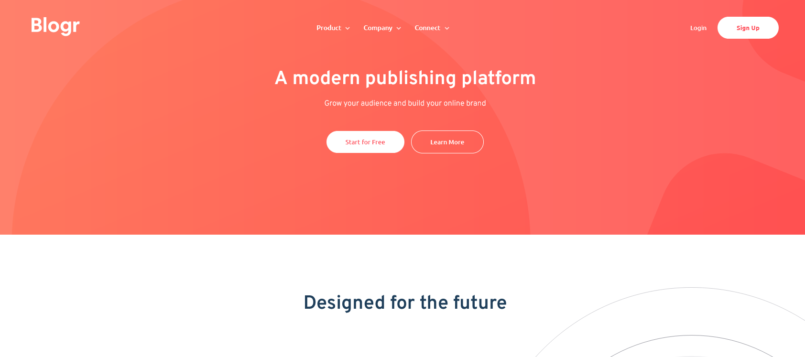

This is a solution to the [Blogr landing page challenge on Frontend Mentor](https://www.frontendmentor.io/challenges/blogr-landing-page-EX2RLAApP).

## Table of contents

- [Overview](#overview)
  - [The challenge](#the-challenge)
  - [Screenshot](#screenshot)
  - [Links](#links)
- [My process](#my-process)
  - [Built with](#built-with)
  - [What I learned](#what-i-learned)

## Overview

### The challenge

Users should be able to:

- View the optimal layout for the site depending on their device's screen size
- See hover states for all interactive elements on the page

### Screenshot

### Links

- [Repository URL](https://github.com/humbruno/blogr-landing)
- [Live Site URL](https://humbruno.github.io/blogr-landing/)

## My process

### Built with

- Semantic HTML5 markup
- SCSS
- Flexbox
- CSS Grid
- Mobile-first workflow
- JavaScript

### What I learned

Making navbars is hard! This was by far the biggest project I've worked on so far, and while making a navbar is quite frustrating for someone with my level of experience, I definitely learned a lot. It was also great continuation practice to handling images and how to properly use absolute positioning.

My confidence in JavaScript is growing steadily and I look forward to doing more exciting things with it!
